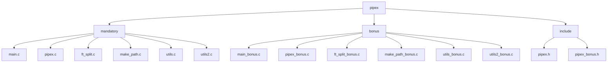

# Pipex

42 Schoolの課題として作成したUnixパイプの実装プログラムです。

## 作成者

**kmiyazaw**

## 概要

Pipexは、Unixシェルのパイプ機能を再現するCプログラムです。
2つのコマンドをパイプで繋ぎ、標準入力から標準出力への連続的な処理を行います。

## プロジェクト構成



## 機能

### Mandatory版
- 2つのコマンドをパイプで接続
- 入力ファイルから読み込み、出力ファイルに書き込み
- 基本的なエラーハンドリング

### Bonus版
- 複数のコマンドをチェーンで接続（n個のコマンド対応）
- より柔軟な引数処理

## 使用方法

### コンパイル

```bash
# Mandatory版をコンパイル
make

# Bonus版をコンパイル
make bonus

# オブジェクトファイルを削除
make clean

# 実行ファイルとオブジェクトファイルを削除
make fclean

# 再コンパイル
make re
```

### 実行

#### Mandatory版
```bash
# 基本的な使用方法
./pipex input.txt "command1" "command2" output.txt

# 例：ファイルの内容を grep と wc で処理
./pipex input.txt "grep hello" "wc -l" output.txt
```

これは以下のシェルコマンドと同等です：
```bash
< input.txt grep hello | wc -l > output.txt
```

#### Bonus版
```bash
# 複数コマンドの連続実行
./pipex input.txt "cmd1" "cmd2" "cmd3" output.txt
```

## 内部動作


## 主要な機能

### パイプ処理
- `pipe()`システムコールを使用してプロセス間通信を実現
- `fork()`で子プロセスを作成
- `dup2()`で標準入出力をリダイレクト

### コマンド実行
- 環境変数`PATH`から実行可能ファイルを検索
- `execve()`でコマンドを実行
- コマンドが見つからない場合の適切なエラーハンドリング

### エラーハンドリング
- ファイルオープンエラー
- コマンド実行エラー
- メモリ割り当てエラー
- システムコールエラー

## 技術的な特徴

- メモリリークの防止
- 適切なファイルディスクリプタの管理
- プロセス同期とエラー処理
- POSIXシステムコールの活用

## 制限事項

- Mandatory版は2つのコマンドのみ対応
- シェルの複雑な機能（リダイレクト、背景実行など）は未対応
- 引数にスペースを含むコマンドは制限あり

## 学習目標

この課題を通じて以下の技術を習得しました：

- Unixプロセス管理
- パイプとファイルディスクリプタ
- システムコールの使用
- メモリ管理
- エラーハンドリング

## 開発環境

- Language: C
- Compiler: gcc
- Flags: -Wall -Wextra -Werror
- Standard: POSIX
